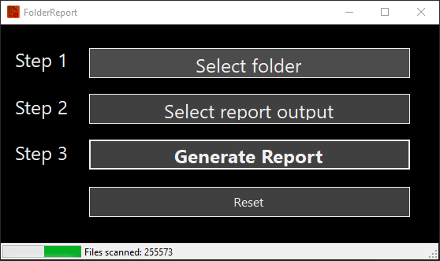

# FolderReport


This tool makes it easy to index a all files in afolder, including subfolders. The application will index millions of files and generate a CSV file with the following data for each file:

* Full filepath
* File extention
* File name
* File directory
* File size in Mb
* File Date/Time created
* File Date/Time Modified

### CSV Header Refrence:
```
fullPath;fileExtention;fileName;fileDirectory;fileSizeMegabytes;fileCreated;fileModified
```

### Screenshot


### Download
[Get the latest release (Windows)](https://github.com/emanueltilly/FolderReport/releases/latest)
